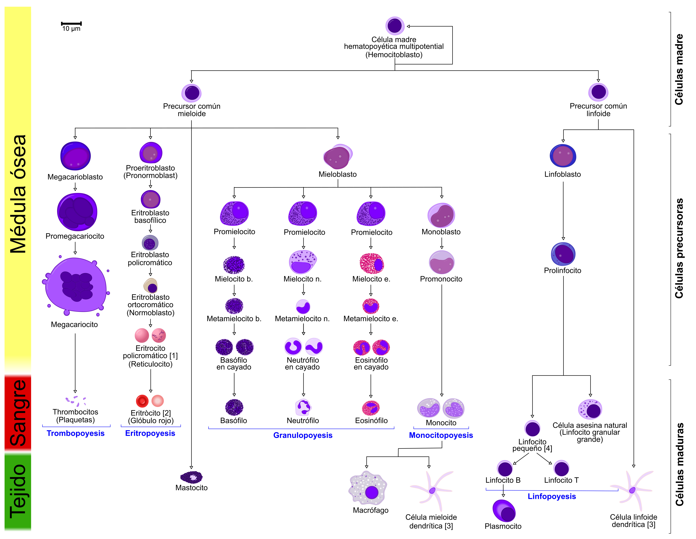

# Células sanguíneas

* **Glóbulos rojos o eritrocitos o hematíes.** Células más abundantes en la sangre. Son pequeñas y sun función es transportar oxígeno y dióxido de carbono.

* **Glóbulos blancos o leucocitos.** Son menos numerosos que los eritrocitos. Su función es defender el organismo ante las infecciones.

* **Plaquetas o trombocitos.** Son trozos de unas células más grandes (los megacariocitos). Ayudan a formar un coágulo para taponar las heridas y evitar que se escape la sangre.

> **Dato curioso**  
> Los eritrocitos son 1000 veces más frecuentes en la sangre que los leucocitos.

*Hematopoyesis o hemopoyesis o proceso de formación, desarrollo y maduración de las células sanguíneas.*