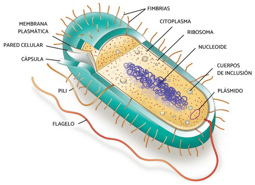
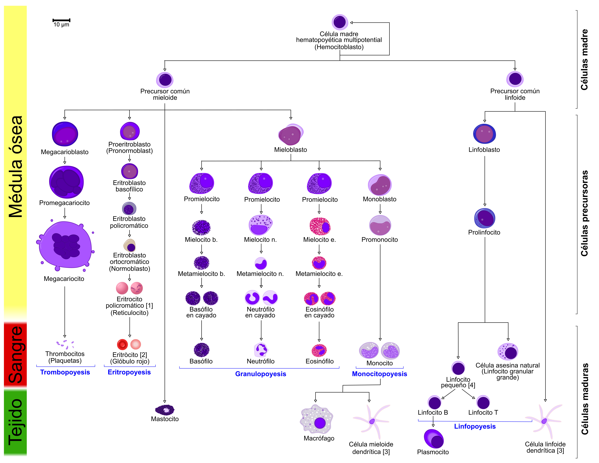
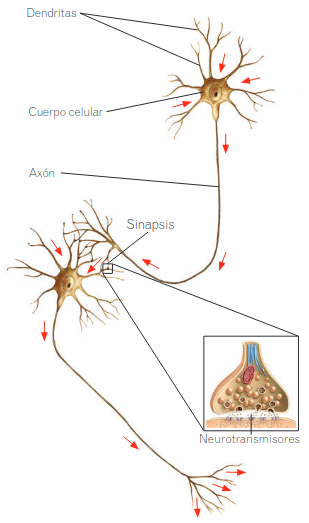
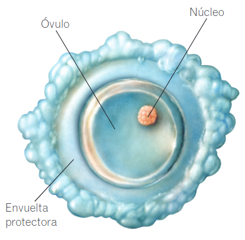
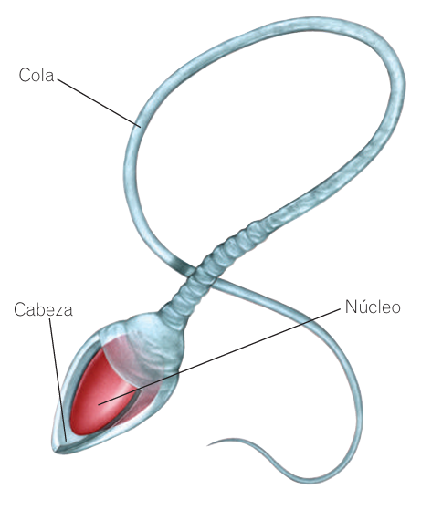

# La Célula

La célula es la unidad más pequeña de la vida, ya que realiza las tres funciones vitales: **nutrición**, **relación** y **reproducción**.

> **Dato curioso**  
> Nuestro cuerpo alberga aproximadamente **100 billones** de células y más de **250 tipos diferentes**.

## Célula procariota

Son las células más simples, de organismos unicelulares, como por ejemplo las **bacterias**, que pertenecen al reino Moneras. Las principales características de las células procariotas son:

* **Carecen de núcleo,** su material genético está disperso en el interior del **citoplasma**.
* **Tienen ribosomas,** pero no poseen ningún otro orgánulo.
* La membrana plasmática está cubierta por una **pared celular**.

Estas células se componen de:

* **Membrana plasmática.** Fina capa que envuelve a la célula y delimita el citoplasma. A través de ella se produce el intercambio de sustancias.
{align=right}
* **Pared bacteriana.** Envoltura rígida y gruesa, formada por [polisacáridos](../organization/biomolecule.md#biomoléculas-orgánicas), que se sitúa por encima de la membrana. Protege y da forma a la bacteria. 
* **Cápsula bacteriana.** Cubierta externa gruesa que no presentan todas las bacterias. Sirve para adherirse y protegerse. [:material-information-outline:{title="Información adicional"}](https://bateriascea.com.ar/capsula-de-las-baterias-procariotas/){: target="_blank"}
* **Cromosoma bacteriano.** El material genético es una molécula circular de ADN dispuesta en una región llamada **nucleoide**.
* **Ribosomas.** Partículas que realizan la síntesis de proteínas.
* **Apéndices.** Pueden ser estructuras como los **flagelos**, que intervienen en el movimiento, y las **fimbrias**, más cortas y numerosas, que ayudan a la bacteria a fijarse a un sustrato.

## Célula eucariota

Son más complejas que las procariotas, y generalmente más grandes. Es el tipo de célula que tienen los seres humanos.

### Membrana plasmática

Es la estructura que delimita la célula y permite el intercambio de sustancias con el exterior. Está formada por una doble capa de **fosfolípidos** (1) en la que se intercalan moléculas de colesterol y diferentes tipos de proteínas. Este modelo de membrana se denomina de **mosaico fluido** porque los elementos que la constituyen se mueven y cambian de posición.

1. Tipo especial de lípidos que están formados por una **cabeza hidrofílica** y unas **colas hidrofóbicas**. Al agruparse en las membranas, las cabezas se orientan hacia los exteriores (dentro y fuera de la célula) y las colas hacia el interior, formando una **bicapa lipídica**.

### Citoplasma

Es el espacio de la célula comprendido entre la membrana y el núcleo. En él se encuentra:

* **Citosol.** Es el medio fluido interno.
* **Orgánulos.** Estructuras que cumplen distintas funciones.
* **Citoesqueleto.** Formado por fibras proteicas que intervienen en el movimiento, la organización interna y la división celular.

### Centrosoma

Está constituido por dos cilindros formados por microtúbulos proteicos llamados **centriolos** (solo presentes en la **célula animal**). Ambos se disponen de forma perpendicular y están rodeados de otros microtúbulos que forman el **áster**. Participan en la organización de las fibras del citoesqueleto, la motilidad (1) celular y la formación del huso mitótico (2) cuando la célula se va a dividir.

1. La habilidad de moverse espontánea e independientemente.
2. Es el conjunto de microtúbulos que brotan de los centrosomas durante los procesos de división celular, sea mitosis (**huso mitótico**) o meiosis (**huso acromático o meiótico**).

### Núcleo

Es la estructura más voluminosa de las células eucariotas. En él se encuentra la gran mayoría del ADN celular, que contiene la información genética. Suele ocupar una posición central en las células animales, mientras que en las vegetales se ve desplazado hacia uno de los lados debido a la presión que ejercen las vacuolas. Suelen tener un solo núcleo, pero existen células con muchos núcleos, llamadas **polinucleadas**, como las células musculares estriadas; y algunas que carecen de él, como los glóbulos rojos de los mamíferos. 

* **Envoltura nuclear.** Formada por una doble membrana, la **externa** y la **interna**, separadas por un **espacio intermembranoso**. La membrana externa está conectada con el retículo endoplasmático rugoso. Ambas membranas están atravesadas por **poros nucleares**, complejos proteicos a través de los cuales se produce el intercambio de sustancias entre el núcleo y el citoplasma.
* * **Nucleoplasma.** Es el medio interno acuoso donde se encuentran inmersos los demás componentes nucleares. Es el lugar en el que se realiza la replicación del ADN nuclear.
* **Nucleolo.** Es un corpúsculo esférico y carente de membrana que solo puede observarse cuando la célula no está en división. Su principal función es la formación de los ribosomas. En una célula puede haber más de un nucleolo.
* **Cromatina.** Está constituida por fibra de ADN en diferentes grados de condensación, asociados a proteínas y dispersos por el nucleoplasma. Cuando la célula va a dividirse, las fibras de cromatina se organizan y se condensan para formar unas estructuras más gruesas denominadas **cromosomas**(1). Existen tantas fibras de cromatina como cromosomas presentará la célula durante la división del núcleo.

1. Los cromosomas humanos están organizados en 23 pares, sumando un total de 46 cromosomas en la mayoría de nuestras células.

### Cromosomas

Son estructuras con forma filamentosa que aparecen durante la división celular. Distribuyen información genética contenida en el ADN de la célula madre a las células hijas.

Químicamente, los cromosomas están constituidos por ADN muy enrollado, al que se unen diferentes proteínas que mantienen su estructura. Cada cromosoma está formado por dos **cromátidas** que se unen en un punto denominado **centrómero**. Una cromátida contiene una molécula de ADN condensada y la otra posee otra molécula de ADN idéntica, resultado de la replicación, por ello se puede hablar en un cromosoma de **cromátidas hermanas**. Cada cromátida presenta dos **brazos** de igual o distinta longitud.

#### Número de cromosomas

Cada especia tiene un número característico de cromosomas. Se puede hablar de:

* **Organismos haploides.** Poseen un solo juego de cromosomas en todas sus células. Se representan con la letra **n**, que indica el número de tipos diferentes de cromosomas presentes en cada célula.
* **Organismos diploides.** Poseen en sus células somáticas (no reproductoras) dos juegos de cromosomas: uno heredado de cada progenitor. Por esta razón en los organismos diploides se reconocen parejas de cromosomas, que se denominan **homólogos**, que son iguales en forma y tamaño y poseen la información genética para los mismos caracteres. Los organismos diploides se representan con **2n**.

-   __Metacéntricos__

    ---

    {width=250, align=right}  
    El centrómero está situado en la parte media del cromosoma. Los brazos tienen aproximadamente la misma longitud.

-   __Submetacéntricos__

    ---

    {width=250, align=right}
    El centrómero está desplazado hacia uno de los lados. Los brazos son ligeramente desiguales.

-   __Acrocéntricos__

    ---

    {width=250, align=right}
    El centrómero está miuy desplazado hacia uno de los extremos del cromosoma. Los brazos son muy desiguales.

-   __Telocéntricos__

    ---

    {width=250, align=right}
    El centrómero se localiza en uno de los extremos del cromosoma. Solo es visible un brazo en el cromosoma.

### Orgánulos

* **Mitocondrias.** Es un orgánulo ovalado con una doble membrana. La externa es lisa y la interna está replegada hacia el interior formando las crestas mitocondriales. En ella, mediante el proceso de **respiración celular**, se obtiene la mayor parte de la energía de la célula.
* **Retículo endoplasmático o R. E.** Es un conjunto de sáculos y canales membranosos interconectados entre sí. Puede ser de dos tipos:
    * **R. E. Rugoso.** Está conectado con la envoltura nuclear y lleva asociados ribosomas. Participa en la síntesis y el transporte de proteínas hacia el aparato de Golgi.
    * **R. E. Liso.** No lleva ribosomas asociados y en él se produce la síntesis de los lípidos.
* **Aparato de Golgi.** Es un conjunto de sacos membranosos aplanados y apilados conectados entre sí. En ellos se almacenan y procesan sustancias transferidas desde el retículo endoplasmático. Del aparato de Golgi se emiten **vesículas de secreción** que contienen productos que se vierten al exterior.
* **Vesículas.** Son sacos membranosos de pequeño tamaño que almacenan, transportan o digieren distintas sustancias celulares, como agua, sustancias de reserva o pigmentos. 
* **Lisosomas.** Son vesículas membranosas redondeadas, procedentes del aparato de Golgi, que contienen enzimas hidrolíticas que participan en la digestión intracelular de sustancias, es decir, que transforman sustancias más complejas en otras más sencillas mediante **hidrólisis**.
* **Ribosomas.** Son partículas pequeñas no membranosas formadas por ARN y proteínas. Pueden estar libres en el citoplasma o adheridos al R. E. rugoso. Realizan la **síntesis de proteínas**.
* **Cilios y flagelos.** Son prolongaciones citoplasmáticas que intervienen en el movimiento celular. Tienen una estructura interna similar, pero los cilios son cortos y abundantes, y los flagelos son largos y una célula suele presentar uno o dos.
* **Citoesqueleto.** Está formado por un conjunto de filamentos proteicos de distinto tipo. Su función es mantener la forma celular, facilitar el movimiento de la célula, de los orgánulos y de las vesículas internas. También participa en la organización de los cromosomas durante la división celular.

*Principales orgánulos celulares.*

## Catabolismo y anabolismo

Estos términos pertenecen a la función de nutrición de la célula, e indican la finalidad y el tipo de reacción que se produce en el **metabolismo celular**: el conjunto de procesos químicos que experimentan los nutrientes dentro de la célula.

* **Catabolismo.** Transformación de sustancias orgánicas complejas, ricas en energía, en compuestos más pequeños y simples. En el catabolismo se obtiene energía, que es utilizada por la célula para sintetizar nuevas moléculas, para la reproducción o para el propio funcionamiento celular.
* **Anabolismo.** Reacciones de tipo constructivo. Comprende los procesos que convierten las sustancias pequeñas y sencillas en sustancias orgánicas complejas propias de la célula, que utiliza para crecer y para reponer estructuras dañadas o perdidas. Para llevar a cabo estos procesos es necesario utilizar energía.

## Células especializadas

### Células sanguíneas

* **Glóbulos rojos o eritrocitos o hematíes.** Células más abundantes en la sangre. Son pequeñas y sun función es transportar oxígeno y dióxido de carbono.

* **Glóbulos blancos o leucocitos.** Son menos numerosos que los eritrocitos. Su función es defender el organismo ante las infecciones.
* **Plaquetas o trombocitos.** Son trozos de unas células más grandes (los megacariocitos). Ayudan a formar un coágulo para taponar las heridas y evitar que se escape la sangre.

> **Dato curioso**  
> Los eritrocitos son 1000 veces más frecuentes en la sangre que los leucocitos.

!!! info inline end "Hematopoyesis"

    Es el proceso de formación, desarrollo y maduración de los elementos de la sangre (eritrocitos, leucocitos y trombocitos) a partir de un precursor celular común e indiferenciado conocido como **célula madre hematopoyética multipotente**.

{ align=left, width="650", loading=lazy }

### Células del sistema nervioso
{width=200, align=right}

* **Neuronas.** Están especializadas en recibir y transmitir información mediante impulsos nerviosos. Tienen un cuerpo celular en el que se encuentra el núcleo, y dos tipos de prolongaciones:
    * **Dendritas.** Prolongaciones muy ramificadas. Reciben y transmiten los impulsos al cuerpo celular.
    * **Axón.** Prolongación larga y delgada que sale del cuerpo celular y se ramifica en su extremo. Envía impulsos desde el cuerpo celular hasta otras neuronas o algún órgano. Las neuronas no se tocan entre sí, sino que existe un espacio entre ellas: la **sinapsis**. A través de este espacio se transmite el impulso nervioso mediante unas sustancias químicas llamadas **neurotransmisores**.
* **Células de glía.** Se encuentran entre las neuronas. Hay diferentes tipos, con diferentes funciones, como aportar nutrientes o protección a las neuronas, o retirada de deshechos.

### Células reproductoras o gametos

|                                                                                                                                                                      **Óvulo**                                                                                                                                                                      |                                                                                                                                                                                                        **Espermatozoide**                                                                                                                                                                                                        |
|:---------------------------------------------------------------------------------------------------------------------------------------------------------------------------------------------------------------------------------------------------------------------------------------------------------------------------------------------------:|:--------------------------------------------------------------------------------------------------------------------------------------------------------------------------------------------------------------------------------------------------------------------------------------------------------------------------------------------------------------------------------------------------------------------------------:|
| Es una célula muy grande con forma esférica. Se producen en los [ovarios](../system/reproductive.md#aparato-reproductor-femenino), dentro de unas cápsulas llamadas **folículos de Graaf**. Cada 28 días, aproximadamente, uno de estos folículos madura, se abre y expulsa un óvulo, que pasa a las trompas de Falopio y se dirige hacia el útero. | Es una célula pequeña con una larga **cola** que le permite desplazarse y una **cabeza** que contiene el núcleo. Se producen continuamente desde la pubertad. Los espermatozoides salen del cuerpo a través de la uretra en un proceso denominado **eyaculación**. Con la eyaculación se expulsa al exterior el **semen**, que contiene los espermatozoides y los líquidos segregados por las vesículas seminales y la próstata. |
|                                                                                                                                                                                                                                                                                                                       |                                                                                                                                                                                     {width=300}                                                                                                                                                                                      |

---