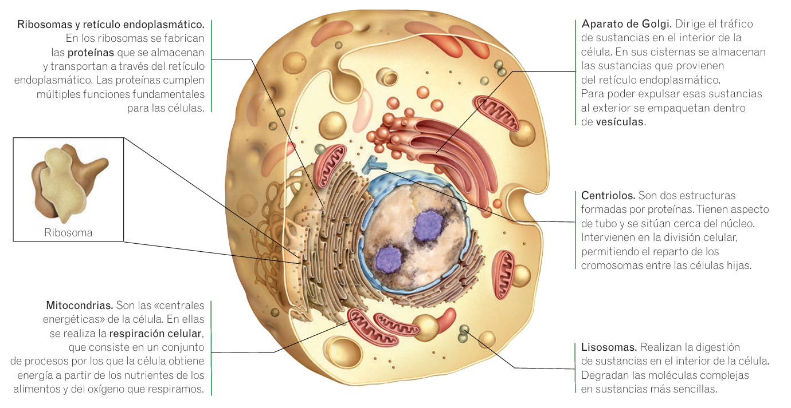

# La Célula

La célula es la unidad más pequeña de la vida, ya que realiza las tres funciones vitales: **nutrición**, **relación** y **reproducción**.

> **Dato curioso**  
> Nuestro cuerpo alberga aproximadamente **100 billones** de células y más de **250 tipos diferentes**.

## Estructura

La célula tiene varias partes esenciales, cada una con una función específica:

* **Membrana plasmática.** Fina capa que envuelve a la célula. A través de ella salen y entran sustancias o desechos.
* **Citoplasma.** Líquido viscoso que ocupa el interior de la célula. En él se encuentran flotando los orgánulos.
* **Núcleo.** Al ser eucariota, nuestras células tienen un núcleo delimitado por una envoltura, de forma esférica. Dentro de él está el material genético que controla el funcionamiento de la célula.
  * **Cromatina.** Formada por fibras de ADN que constituyen el material genético de la célula, cuando la célula se prepara para dividirse, la cromatina se condensa y forma estructuras llamadas **cromosomas**.

> **Dato curioso**  
> Los cromosomas humanos están organizados en **23 pares**, sumando un total de **46 cromosomas** en la mayoría de nuestras células.

## Orgánulos

* **Ribosomas.** Se encargan de fabricar las proteínas.
* **Retículo endoplasmático.** En él se almacenan y transportan las proteínas fabricadas por los ribosomas.
* **Aparato de Golgi.** Dirige el tráfico de sustancias en el interior de la célula. En sus cisternas se almacenan las sustancias que provienen del retículo endoplasmático. Para poder expulsar esas sustancias al exterior se empaquetan dentro de **vesículas**.
* **Mitocondrias.** Son las «centrales energéticas» de la célula. En ellas se realiza la **respiración celular**.
* **Centriolos.** Son dos estructuras formadas por proteínas. Tienen aspecto de tubo y se sitúan cerca del núcleo. Intervienen en la división celular, permitiendo el reparto de los cromosomas entre las células hijas.
* **Lisosomas.** Realizan la digestión de sustancias en el interior de la célula. Degradan las moléculas complejas en sustancias más sencillas.

*Principales orgánulos celulares.*

---
