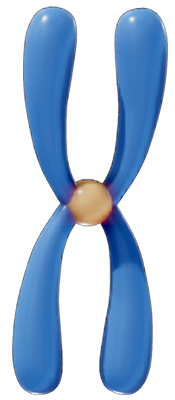
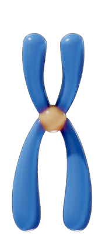
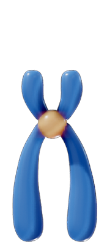
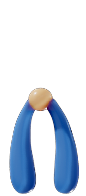
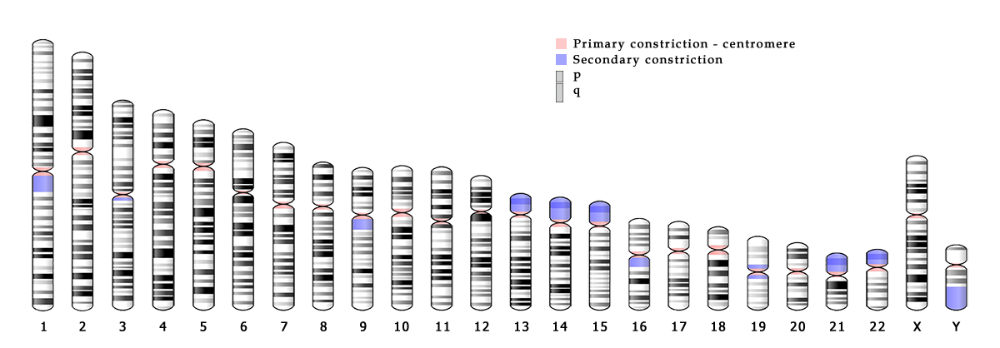
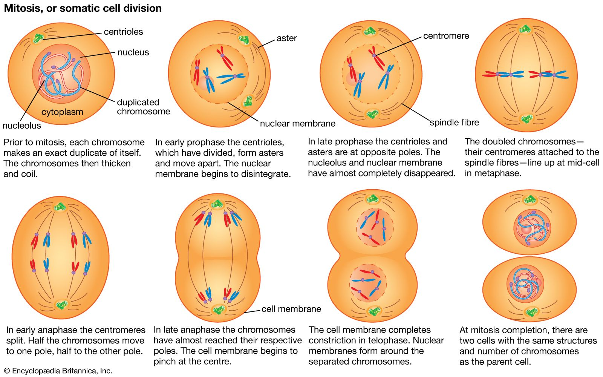
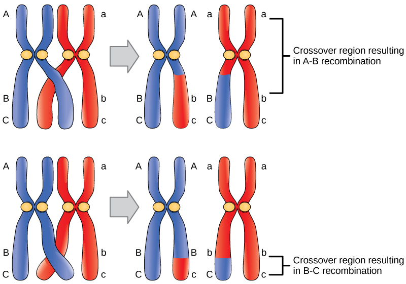

# La célula eucariota

La célula eucariota se caracteriza, en contraposición con a célula procariota, por tener un núcleo que contiene el material genético de la célula en lugar de tenerlo suelto en el citoplasma, tener otros orgánulos que no son solo los ribosomas, y poseen centrosomas que se usan durante el proceso de la división celular.

## Membrana plasmática

Es la estructura que delimita la célula y permite el intercambio de sustancias con el exterior. Está formada por una doble capa de **fosfolípidos** (1) en la que se intercalan moléculas de colesterol y diferentes tipos de proteínas. Este modelo de membrana se denomina de **mosaico fluido** porque los elementos que la constituyen se mueven y cambian de posición.

1. Tipo especial de lípidos que están formados por una **cabeza hidrofílica** y unas **colas hidrofóbicas**. Al agruparse en las membranas, las cabezas se orientan hacia los exteriores (dentro y fuera de la célula) y las colas hacia el interior, formando una **bicapa lipídica**.

## Citoplasma

Es el espacio de la célula comprendido entre la membrana y el núcleo. En él se encuentra:

* **Citosol.** Es el medio fluido interno.
* **Orgánulos.** Estructuras que cumplen distintas funciones.
* **Citoesqueleto.** Formado por fibras proteicas que intervienen en el movimiento, la organización interna y la división celular.

## Centrosoma

Está constituido por dos cilindros formados por microtúbulos proteicos llamados **centriolos** (solo presentes en la **célula animal**). Ambos se disponen de forma perpendicular y están rodeados de otros microtúbulos que forman el **áster**. Participan en la organización de las fibras del citoesqueleto, la motilidad (1) celular y la formación del huso mitótico (2) cuando la célula se va a dividir.

1. La habilidad de moverse espontánea e independientemente.
2. Es el conjunto de microtúbulos que brotan de los centrosomas durante los procesos de división celular, sea mitosis (**huso mitótico**) o meiosis (**huso acromático o meiótico**).

## Núcleo

Es la estructura más voluminosa de las células eucariotas. En él se encuentra la gran mayoría del ADN celular, que contiene la información genética. Suele ocupar una posición central en las células animales, mientras que en las vegetales se ve desplazado hacia uno de los lados debido a la presión que ejercen las vacuolas. Suelen tener un solo núcleo, pero existen células con muchos núcleos, llamadas **polinucleadas**, como las células musculares estriadas; y algunas que carecen de él, como los glóbulos rojos de los mamíferos.

* **Envoltura nuclear.** Formada por una doble membrana, la **externa** y la **interna**, separadas por un **espacio intermembranoso**. La membrana externa está conectada con el retículo endoplasmático rugoso. Ambas membranas están atravesadas por **poros nucleares**, complejos proteicos a través de los cuales se produce el intercambio de sustancias entre el núcleo y el citoplasma.
* * **Nucleoplasma.** Es el medio interno acuoso donde se encuentran inmersos los demás componentes nucleares. Es el lugar en el que se realiza la replicación del ADN nuclear.
* **Nucleolo.** Es un corpúsculo esférico y carente de membrana que solo puede observarse cuando la célula no está en división. Su principal función es la formación de los ribosomas. En una célula puede haber más de un nucleolo.
* **Cromatina.** Está constituida por fibra de ADN en diferentes grados de condensación, asociados a proteínas y dispersos por el nucleoplasma. Cuando la célula va a dividirse, las fibras de cromatina se organizan y se condensan para formar unas estructuras más gruesas denominadas **cromosomas**(1). Existen tantas fibras de cromatina como cromosomas presentará la célula durante la división del núcleo.

1. Los cromosomas humanos están organizados en 23 pares, sumando un total de 46 cromosomas en la mayoría de nuestras células.

## Cromosomas

Son estructuras con forma filamentosa que aparecen durante la división celular. Distribuyen información genética contenida en el ADN de la célula madre a las células hijas.

Químicamente, los cromosomas están constituidos por ADN muy enrollado, al que se unen diferentes proteínas que mantienen su estructura. Cada cromosoma está formado por dos **cromátidas** que se unen en un punto denominado **centrómero**. Una cromátida contiene una molécula de ADN condensada y la otra posee otra molécula de ADN idéntica, resultado de la replicación, por ello se puede hablar en un cromosoma de **cromátidas hermanas**. Cada cromátida presenta dos **brazos** de igual o distinta longitud.

### Número de cromosomas

Cada especia tiene un número característico de cromosomas. Se puede hablar de:

* **Organismos haploides.** Poseen un solo juego de cromosomas en todas sus células. Se representan con la letra **n**, que indica el número de tipos diferentes de cromosomas presentes en cada célula. En el caso de los espermatozoides y óvulos, son organismos haploides que poseen un juego de 23 cromosomas individuales, por una parte, seleccionados del padre y, por otra parte, seleccionados de la madre.
* **Organismos diploides.** Poseen en sus células somáticas (no reproductoras) dos juegos de cromosomas: uno heredado de cada progenitor. Por esta razón en los organismos diploides se reconocen parejas de cromosomas, que se denominan **homólogos**, que son iguales en forma y tamaño y poseen la información genética para los mismos caracteres. Los organismos diploides se representan con **2n**. Es el caso de los cigotos, por ejemplo, que al juntarse un espermatozoide con un óvulo se mezclan dichos cromosomas, formando un organismo diploide. Para el resto del cuerpo, exceptuando el caso de eritrocitos, todas nuestras células contienen dichos 23 pares de cromosomas. Estos pares de cromosomas son igual en tamaño, forma y función, pero cómo realizan su función (color de ojos, altura, tamaño) es diferente entre el cromosoma heredado del padre y de la madre. Para el caso de las personas con **síndrome de Down**, tienen no dos, sino tres cromosomas en el cromosoma 21.

-   __Metacéntricos__

    ---
    {width=50, align=right}  
    El centrómero está situado en la parte media del cromosoma. Los brazos tienen aproximadamente la misma longitud.

-   __Submetacéntricos__

    ---
    {width=50, align=right}
    El centrómero está desplazado hacia uno de los lados. Los brazos son ligeramente desiguales.

-   __Acrocéntricos__

    ---
    {width=50, align=right}
    El centrómero está miuy desplazado hacia uno de los extremos del cromosoma. Los brazos son muy desiguales.

-   __Telocéntricos__

    ---
    {width=50, align=right}
    El centrómero se localiza en uno de los extremos del cromosoma. Solo es visible un brazo en el cromosoma.

### Cariotipo

Es el conjunto característico de cromosomas de una especia. Mediante el estudio del cariotipo es posible detectar anomalías en el número o la forma de los cromosomas, incluso de un feto. Como hemos mencionado, el cariotipo humano está constituido por 23 cromosomas, de los cuales se dividen en dos grupos:

* **Heterocromosomas** o **cromosomas sexuales.** Son muy diferentes el uno del otro e intervienen en la determinación del sexo. Se encuentran únicamente en el cromosoma 23, es decir, en el último. Pueden ser o **X** o **Y**. En el caso de los hombres, el cromosoma 23 serán un par **XY**; para el caso de las mujeres, el cromosoma 23 será **XX**.
* **Autosomas.** Constituyen el resto de cromosomas, y son iguales en ambos sexos, en forma, estructura, tamaño y función.

***Ideograma** o representación y ordenación del conjunto de cromosomas de una célula, por parejas de homólogos según forma y tamaño.*

## Orgánulos

* **Mitocondrias.** Es un orgánulo ovalado con una doble membrana. La externa es lisa y la interna está replegada hacia el interior formando las crestas mitocondriales. En ella, mediante el proceso de **respiración celular**, se obtiene la mayor parte de la energía de la célula.
* **Retículo endoplasmático o R. E.** Es un conjunto de sáculos y canales membranosos interconectados entre sí. Puede ser de dos tipos:
    * **R. E. Rugoso.** Está conectado con la envoltura nuclear y lleva asociados ribosomas. Participa en la síntesis y el transporte de proteínas hacia el aparato de Golgi.
    * **R. E. Liso.** No lleva ribosomas asociados y en él se produce la síntesis de los lípidos.
* **Aparato de Golgi.** Es un conjunto de sacos membranosos aplanados y apilados conectados entre sí. En ellos se almacenan y procesan sustancias transferidas desde el retículo endoplasmático. Del aparato de Golgi se emiten **vesículas de secreción** que contienen productos que se vierten al exterior.
* **Vesículas.** Son sacos membranosos de pequeño tamaño que almacenan, transportan o digieren distintas sustancias celulares, como agua, sustancias de reserva o pigmentos.
* **Lisosomas.** Son vesículas membranosas redondeadas, procedentes del aparato de Golgi, que contienen enzimas hidrolíticas que participan en la digestión intracelular de sustancias, es decir, que transforman sustancias más complejas en otras más sencillas mediante **hidrólisis**.
* **Ribosomas.** Son partículas pequeñas no membranosas formadas por ARN y proteínas. Pueden estar libres en el citoplasma o adheridos al R. E. rugoso. Realizan la **síntesis de proteínas**.
* **Cilios y flagelos.** Son prolongaciones citoplasmáticas que intervienen en el movimiento celular. Tienen una estructura interna similar, pero los cilios son cortos y abundantes, y los flagelos son largos y una célula suele presentar uno o dos.
* **Citoesqueleto.** Está formado por un conjunto de filamentos proteicos de distinto tipo. Su función es mantener la forma celular, facilitar el movimiento de la célula, de los orgánulos y de las vesículas internas. También participa en la organización de los cromosomas durante la división celular.

*Principales orgánulos celulares.*

## Ciclo celular

El tiempo que tarda cada célula en reproducirse es variable. Hay algunas que no se reproducen nunca, como los eritrocitos o las células musculares estriadas. Por el contrario, otras, como las del epitelio intestinal, tardan solo unas ocho horas en hacerlo. La reproducción se realiza mediante la **división celular**, generando dos células hijas idénticas a la madre. El ciclo celular es la secuencia de modificaciones que sufre una célula desde su formación hasta su división. Puede durar de unas pocas horas a algunos días, y depende de muchos factores. Se diferencian dos fases:

* **Interfase** o **fase de no división.** Fase inicial de larga duración en la que se puede observar el núcleo celular, denominado **núcleo interfásico**. Durante esta fase la célula crece, realiza muchas funciones, y se **replica** el ADN para que cuando se divida las hijas tengan el mismo.
* **Fase de división** o **fase M.** Fase final de corta duración en la que el núcleo desaparece y los cromosomas se hacen visibles. Comprende la división del núcleo o **mitosis** y ñla división del citoplasma o **citocinesis**.

## División celular

En la fase de división o fase M, a partir de una célula madre dse originan dos células hijas con idéntico número de cromosomas que la progenitora. En las células eucariotas, la división celular comprende dos procesos:

### Mitosis

Antes de iniciarse la división del núcleo, el ADN se duplica, pero los cromosomas no pueden observarse debido a que la cromatina aún no se ha condensado. También se duplica el centrosoma, y los centríolos si la célula es animal. Aunque es un proceso continuo, se pueden distinguir cuatro fases:

-   __Profase__

    ---
    La cromatina se condensa y los cromosomas se hacen visibles. Al final de la profase, el nucléolo y la envoltura nuclear desaparecen y comienza a constituirse el **huso mitótico**. Este huso mitótico está formado por la unión de los áster, es decir, microtúbulos que salen del centrosoma. Cuando el centrosoma se duplica durante el proceso de división, cada uno se dirige, al rededor del núcleo, a polos opuestos, uniendo los "cables" que son el áster y formando el huso mitótico.

-   __Metafase__

    ---
    Los cromosomas, totalmente condensados, se disponen en el centro de la célula, formando la **placa ecuatorial**, y se adhieren por el centrómero a los filamentos de huso mitótico. Es decir, los puntos que unen a los cromosomas, que son los centrómeros, se colocan exactamente por donde pasan los filamentos del huso mitótico.

-   __Anafase__

    ---
    Las cromátidas hermanas (es decir, que están unidas por el centrómero) de cada cromosoma se separan y se dirigen a polos opuestos de la célula, arrastradas por los filamentos del huso.

-   __Telofase__

    ---
    Reaparece el nucléolo y comienza a formarse la envoltura nuclear. Desaparece el huso mitótico y los cromosomas se condensan para constituir de nuevo la cromatina.

*Descripción del proceso de mitosis.*

<iframe width="560" height="315" src="https://www.youtube.com/embed/TnJL_8ZVbTI"
title="YouTube video player" frameborder="0"
allow="accelerometer; autoplay; clipboard-write; encrypted-media; gyroscope; picture-in-picture"
allowfullscreen></iframe>

### Citocinesis

Una vez concluida la división del núcleo tiene lugar la división del citoplasma y el reparto de los orgánulos entre las dos nuevas células hijas. El proceso ocurre de forma diferente en células animales y vegetales.

* En las **células animales** se realiza por estrangulación del citoplasma a nivel del ecuador de la célula.
* En las **células vegetales** se forma entre las células hijas un tabique de separación denominado **fragmoplasto** que dará lugar a la pared celular.

## Meiosis

Es un tipo de división reduccional, ya que a partir de una célula madre diploide (2n) se forman células hijas haploides (n), es decir, con la mitad del contenido de ADN que la célula progenitora. En todos los vertebrados, la meiosis tiene lugar en las **gónadas** y las células que se forman son los **gametos**. Durante la meiosis se producen dos divisiones nucleares sucesivas, por lo que al final se forman **cuatro células hijas haploides**, genéticamente diferentes entre sí y distintas a la célula madre.

-   __Interfase__

    ---<
    Antes de iniciarse la primera división meiótica tiene lugar un periodo de interfase en el que se duplica el ADN.

-   __Profase I__

    ---
    Los cromosomas se condensan hasta hacerse visibles. Desaparece el nucléolo y se desorganiza la envoltura nuclear. Los cromosomas homólogos se aparean e intercambian fragmentos de ADN. Este proceso se conoce como **sobrecruzamiento**, y asegura que las células hijas sean genéticamente distintas a la célula madre.

-   __Metafase I__

    ---
    Los cromosomas homólogos se disponen por parejas en el ecuador de la célula.

-   __Anafase I__

    ---
    Arrastrados por los filamentos del huso, los cromosomas homólogos se separan y se dirigen a polos opuestos de la célula.

-   __Telofase I y citocinesis__

    ---
    Se forman dos células hijas haploides (n) con la mitad de cromosomas que la célula madre.

-   __Profase II__

    ---
    Sin pasar por un período de interfase, se vuelve a formar el huso. Los cromosomas, constituidos por dos cromátidas, se mueven hacia la placa ecuatorial.

-   __Metafase II__

    ---
    Los cromosomas se disponen en el ecuador de la célula.

-   __Anafase II__

    ---
    Se separan las cromátidas hermanas y cada una se dirige hacia un extremo de la célula.

-   __Telofase II y citocinesis__

    ---
    Se obtienen cuatro células hijas haploides (n) distintas, cada una con la mitad de cromosomas que la célula madre.

*Entrecruzamiento de cromosomas*