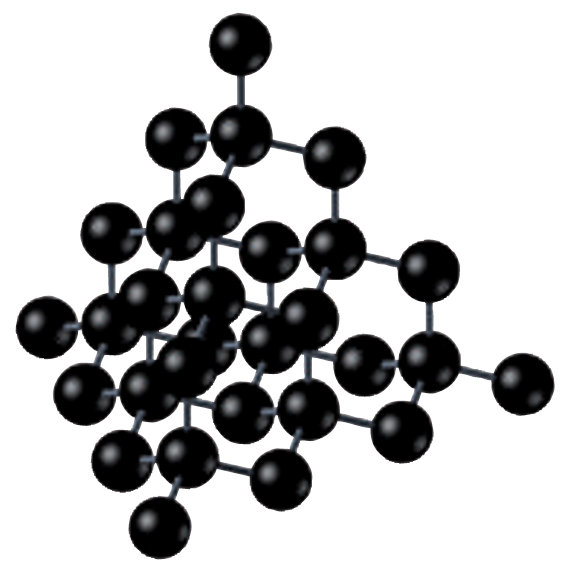

# Química

Secciones de diferente índole para entender mejor la biología

## Términos

* **Isómero.** Dos compuestos con la misma fórmula molecular pero una estructura diferente. Ejemplo: tanto la glucosa como la fructosa poseen de fórmula C$_6$H$_1{_2}$O$_6$, pero la distribución de sus átomos es diferente.
* **Número másico.** Número de protones (_Z_) más el número de neutrones (_A_).
* **Ion.** Cuando un átomo deja de estar neutro, y tiene más o menos electrones que protones. Si es positivo, se llama **catión**, y si es negativo se llama **anión**.
* **Cristal.** En vez de haber una molécula con un número de átomos fijos, los átomos pueden agruparse en estructuras llamadas cristales, que están constituidas por muchos átomos unidos entre sí formando agrupaciones ordenadas en el espacio como redes tridimensionales.

{width=500, align=left}
"){width=500, align=right}

## Moléculas

* Oxígeno: O$_2$ 
* Ozono: O$_3$
* Agua: H$_2$O (monóxido de dihidrógeno)
* Amoniaco: NH$_3$ (trihidruro de nitrógeno)
* Sal común: NaCl (cloruro de sodio)
* Sosa: NaOH (hidróxido de sodio)
* Glucosa: C$_6$H$_1{_2}$O$_6$
* Colesterol: C$_2{_7}$H$_4{_6}$O
* Polietileno: (CH$_2$)$_n$
* Lejía: NaClO
* Agua oxigenada: H$_2$O$_2$ (peróxido de sodio)

## Tabla periódica

| Metales                                                                | No metales                                                                    | Gases nobles                     |
|------------------------------------------------------------------------|-------------------------------------------------------------------------------|----------------------------------|
| Tienen a perder electrones y formar cationes                           | Tienen a ganar electrones y formar aniones                                    | No tienen a formar iones         |
| A temperatura ambiente son sólidos (menos el mercurio, que es líquido) | A temperatura ambiente son sólidos (azufre), líquidos (bromo) o gases (flúor) | A temperatura ambiente son gases |
| Son buenos conductores de la electricidad y el calor                   | Son malos conductores de la electricidad y el calor                           |                                  |
| Tienen elevadas temperaturas de fusión y ebullición                    | Tienen temperaturas de fusión y ebullición muy variadas                       |                                  |
| Son dúctiles y maleables                                               |                                                                               |                                  |

* **Alcalinos.** Se sitúan en el grupo 1. Para conseguir una configuración estable, los átomos de los alcalinos pierden 1 electrón y se convierten en iones con carga +1.
* **Alcalinotérreos.** Se sitúan en el grupo 2. Sus átomos deben perder 2 electrones para conseguir una configuración más estable: se convierten en iones con carga +2.
* **Halógenos.** Están situados en el grupo 17. Forman iones con carga -1.
* **Gases nobles.** Se sitúan en el grupo 18. No ganan ni pierden electrones, por lo que no forman iones.

## Medicamentos

* **Antibióticos**, como la penicilina y la amoxicilina, que combaten las bacterias.
* **Analgésicos** y **antipiréticos**, como el paracetamol y el ibuprofeno, que combaten el dolor y reducen la fiebre, respectivamente.
* **Desinfectantes**, como el alcohol o el agua oxigenada, que destruyen los microorganismos que puedan penetrar a través de la piel.
* **Antiinflamatorios**, como los corticoides, que combaten la inflamación.
* **Vacunas**, que previenen enfermedades como el sarampión.

## Formulación inorgánica

### Conceptos previos

* **Valencia.** Es la capacidad que posee un elemento para combinarse con otro. El H tiene valencia 1, el C tiene valencia 4, y el N tiene valencia 3. Todo esto tiene que ver con la capa de valencia y la configuración electrónica de un átomo, es decir, el número de electrones que tiene en la última capa de electrones (nivel de valencia).
* **Número de oxidación o de valencia.** Número de electrones que un átomo capta o cede al formar un compuesto. Es negativo si gana electrones, y positivo si los pierde.
