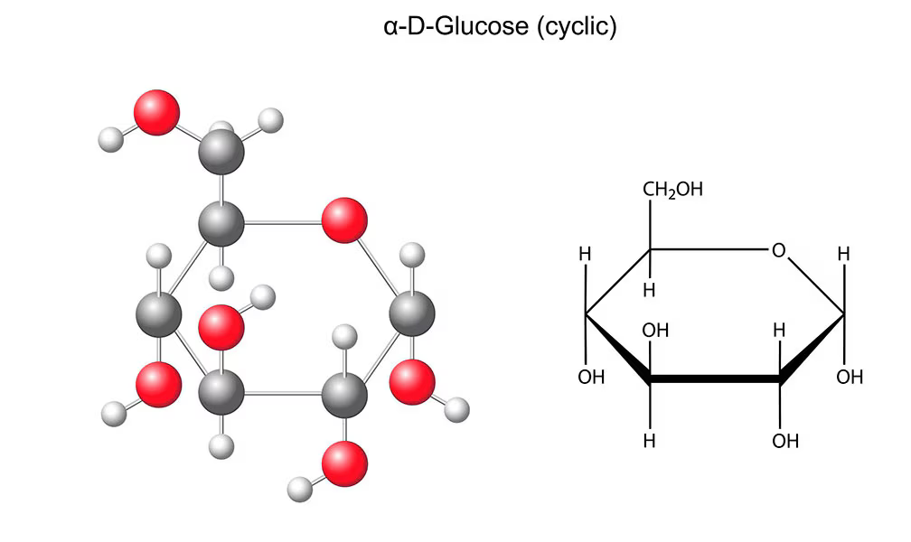
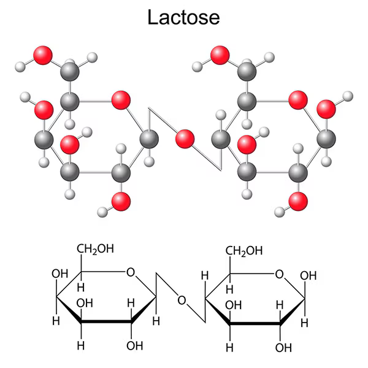

# Biomoléculas

Las biomoléculas son moléculas formadas por bioelementos. Se dividen en biomoléculas inorgánicas y orgánicas.

## Biomoléculas inorgánicas

* **Agua.** Es la sustancia más abundante en todos los seres vivos. Constituye alrededor del 65% de nuestro cuerpo, aunque su distribución varía de unos órganos a otros; por ejemplo, la sangre y el cerebro contienen mayor cantidad de agua que los huesos. Es también el componente principal de las células y de los líquidos internos, como la sangre.
* **Sales minerales.** Son sustancias que, en los seres vivos, pueden aparecer disueltas en forma de **iones**, como el ion sodio (Na⁺) o el ion potasio (K⁺), o precipitadas en forma de **cristales**, como el fosfato y el carbonato cálcico.

## Biomoléculas orgánicas

* **Glúcidos, carbohidratos o hidratos de carbono.** Son moléculas formadas por **monosacáridos**, como la **glucosa** o la **fructosa**. La unión de dos monosacáridos forma un **disacárido**, como la **sacarosa**, la **maltosa** o la **lactosa**. La unión de varios monosacáridos forma los **polisacáridos**, como el **glucógeno** o la **celulosa**.
* **Lípidos.** Son moléculas de naturaleza química muy variada. Entre ellos se encuentran las **grasas**, los **fosfolípidos** y el **colesterol**. Las grasas son los lípidos más simples y se pueden descomponer en **ácidos grasos** y en un alcohol, el **glicerol**.
* **Proteínas.** Son macromoléculas constituidas por la unión de muchas moléculas denominadas **aminoácidos**. Algunas proteínas importantes del ser humano son el **colágeno**, la **hemoglobina** o los **anticuerpos**.
* **Ácidos nucleicos.** Son grandes biomoléculas formadas por la unión de otras más pequeñas llamadas **nucleótidos**. Hay dos tipos: el **ADN** o **ácido desoxirribonucleico** y el **ARN** o **ácido ribonucleico**.

## Elementos

Sección dedicada a desmembrar los elementos más básicos que dan forma a las biomoléculas u otros conceptos.

* **Monosacáridos.** También llamados azúcares simples (a pesar de que solo unos pocos tienen un sabor dulce), son las formas más simples de azúcar y las unidades más básicas (monómeros) a partir de las cuales se construyen todos los glúcidos.

{width=500, align=left}
{width=400, align=right}

---