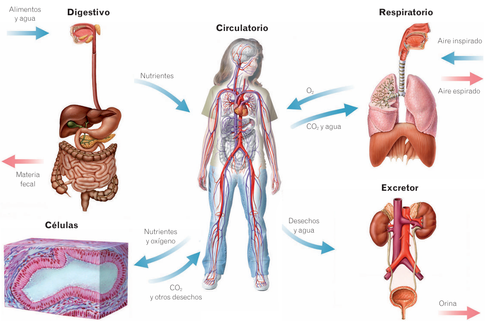

# Funciones vitales

## Nutrición

La función de la nutrición permite que el organismo obtenga la energía y materia necesaria para seguir sobreviviendo.

Los aparatos implicados en este proceso son:

* **[Aparato digestivo](../system/digestive.md).** Se encarga de recibir los alimentos y transformárlos en sustancias más sencillas para que las usen las células llamadas nutrientes.
* **[Aparato respiratorio](../system/respiratory.md).** Se encarga de tomar O$_2$ para que lo usen nuestras células y expulsar el CO$_2$ que producen como deshecho.
* **[Aparato circulatorio](../system/circulatory.md).** Distribuye el O$_2$ y los nutrientes, es decir, lo producido por el aparato digestivo y respiratorio, a todas las células de nuestro cuerpo, al igual que recoger sus deshechos.
* **[Aparato excretor](../system/excretory.md).** Retira de la sangre las sustancias de deshecho y las expulsa al exterior.

*Aparatos que participan en la función de nutrición.*

## Reproducción

La función de reproducción es la capacidad de producir nuevos seres vivos parecidos a los progenitores. El aparato principal asociado a esta función es el **[aparato reproductor](../system/reproductive.md)**. 

En el caso del ser humano, las características asociadas a la función de la reproducción son:
* **Reproducción sexual.** Se necesitan dos células sexuales o **gametos**, una femenina y otra masculina. El hombre produce las células sexuales masculinas, los **espermatozoides**, y las mujeres las células sexuales femeninas, los **óvulos**.
* **Fecundación interna.** Porque se produce en el interior del aparato reproductor femenino.
* **Especie vivípara.** Como el resto de mamíferos, el nuevo ser se desarrolla en el interior de la madre y nace formado.

Nuestra especie puede dividir sus órganos sexuales en **caracteres sexuales primarios**, es decir, aquellos que están presentes desde el nacimiento, como son los órganos internos y externos del aparato reproductor; y **caracteres sexuales secundarios**, es decir, aquellos que aparecen en la pubertad y definen esos factores fisiológicos que tanto diferencian a hombres de mujeres mediante la acción de hormónas. Es en la pubertad donde aparecen los espermatozoides y cuando se produce la primera menstruación.