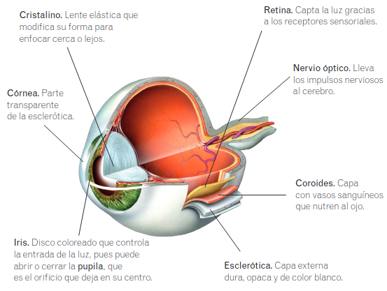
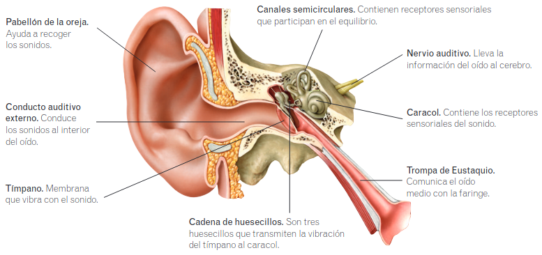
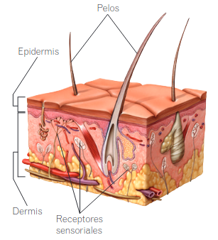
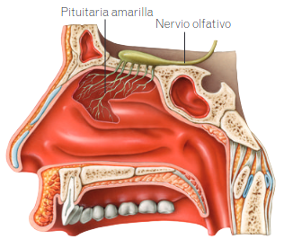
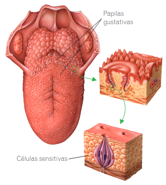

# Los sentidos

## Los receptores sensoriales

## El sentido de la vista

El ojo es el órgano del sentido de la vista. Capta los estímulos luminosos gracias a los receptores sensoriales de la retina.

* **Globo ocular.** Esfera rellena de un líquido que está formada por tres capas:
    * **Esclerótica.** Capa externa dura, opaca y de color blanco. Tiene una parte transparente llamada **córnea**.
    * **Coroides.** Capa con vasos sanguíneos que nutren al ojo.
    * **Retina.** Capta la luz gracias a los receptores sensoriales.
    
    Además de estas capas, otros elementos que conforman el globo ocular son:
    * **Iris.** Disco coloreado que controla la entrada de la luz, pues puede abrir o cerrar la **pupila**, que es el orificio que deja en su centro.
    * **Cristalino.** Lente elástica que modifica su forma para enfocar cerca o lejos.
    * **Nervio óptico.** Lleva los impulsos nerviosos al cerebro. 
* **Órganos anejos.** Su función es proteger al ojo y permitir su movimiento. Son las cejas, las pestañas, los párpados, las glándulas lacrimales y los músculos que mueven el ojo.

## El sentido del oído

Los oídos son los órganos encargados de la audición. Sus receptores sensoriales se encuentran en el caracol.

* **Pabellón de la oreja.** Ayuda a recoger los sonidos.
* **Conductor auditivo externo.** Conduce los sonidos al interior del oído.
* **Tímpano.** Membrana que vibra con el sonido.
* **Cadena de huesecillos.** Tres huesecillos que transmiten la vibración del tímpano al caracol.
* **Canales semicirculares.** Contienen receptores sensoriales que participan en el equilibrio.
* **Caracol.** Contiene los receptores sensoriales del sonido.
* **Nervio auditivo.** Lleva la información del oído al cerebro.
* **Trompa de Eustaquio.** Comunica el oído medio con la faringe.

## El sentido del tacto

La piel es el órgano del sentido del tacto. Contiene receptores sensoriales que captan la presión, la temperatura, el dolor... Existen zonas de la piel con más cantidad de receptores sensoriales y, por lo tanto, más sensibles al tacto, como la punta de los dedos o los labios.

* **Epidermis.** La capa externa. La parte más externa de esta capa está formada por células muertas que se desprenden continuamente en forma de escamas.
* **Dermis.** La capa interna. Contiene vasos sanguíneos y los receptores sensoriales del tacto.

## El sentido del olfato

El órgano del sentido del olfato es la nariz. Los receptores sensoriales se hallan en su interior y forman la pituitaria amarilla. Los receptores del olfato captan **sustancias químicas** en estado gaseoso y envían la información al cerebro por el **nervio olfativo**. El cerebro recibe la información y crea la sensación del olor. El olfato nos permite identificar un gran número de sustancias químicas diferentes.

## El sentido del gusto

Los receptores del sentido del gusto se encuentran en las **papilas gustativas**, en el interior de la boca, que son pequeños abultamientos con células nerviosas. Nos permiten identificar sustancias químicas disueltas en la saliva, que dan origen a los cuatro sabores básicos: dulce, salado, ácido y amargo.

El olfato y el gusto están muy relacionados: cuando introducimos un alimento en la boca, algunas de las sustancias que lo forman se disuelven en la saliva y estimulan las papilas gustativas. Además, otras sustancias se evaporan y llegan a la nariz. Por tanto, el sabor de los alimentos es una mezcla de las sensaciones del gusto y del olfato.

---