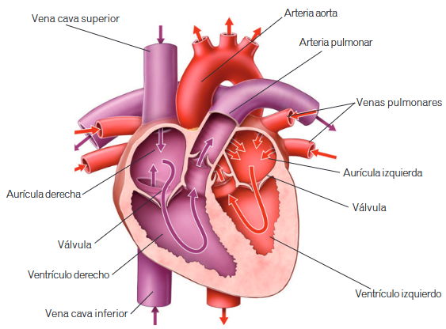

# Aparato circulatorio

## Anatomía

### Vasos sanguíneos

Son los conductos por los que circula la sangre.

* **Arterias.** Llevan la sangre del corazón a los demás órganos del cuerpo. Sus paredes son gruesas porque soportan la presión con la que la sangre sale del corazón.
* **Venas.** Conducen la sangre desde los órganos al corazón. Sus paredes son más finas, pues la sangre circula con menos presión. Tienen válvulas para evitar que la sangre retroceda.
* **Capilares.** Son unos vasos microscópicos que forman una red que comunica las arterias con las venas. Sus paredes son tan finas que permiten el intercambio de nutrientes, desechos, oxígeno y dióxido de carbono entre la sangre y las células.

### Sangre

La sangre es un líquido de color rojo y sabor salado que circula por el interior de los vasos sanguíneos.

* **Plasma.** Es un líquido de color amarillento compuesto por agua con numerosas sustancias disueltas en ella, como nutrientes, sales minerales y sustancias de desecho.
* **[Células sanguíneas](../cell/blood-cell.md).**

### Corazón

El corazón es el órgano que impulsa la sangre para que llegue a todas las partes del cuerpo. El corazón es un órgano del tamaño de un puño cuyas paredes están formadas por tejido muscular. Estas paredes se contraen y se relajan continuamente a fin de impulsar la sangre a todo el cuerpo. El interior del corazón está dividido en dos mitades, izquierda y derecha, separadas por un tabique que evita que la sangre de las dos mitades se mezcle. Cada mitad tiene dos cámaras: una superior llamada **aurícula**, a la que llegan las venas con sangre del cuerpo, y otra cámara inferior llamada **ventrículo**, que impulsa la sangre a través de las arterias.

La sangre llega a las aurículas a través de las venas cavas y las venas pulmonares. Cuando se contraen las aurículas, la sangre pasa de las aurículas a los ventrículos. Cuando se contraen los ventrículos, la sangre sale de ellos a través de la arteria aorta y la arteria pulmonar. Entre las aurículas y los ventrículos hay unas válvulas que hacen que la sangre no pase nunca de los ventrículos a las aurículas.

#### El latido cardiaco

La contracción del músculo cardiaco se llama **sístole**, y la relajación, **diástole**. La sucesión de sístoles y diástoles da lugar al latido cardiaco, que se puede detectar apoyando la mano sobre el pecho. La sístole de las aurículas hace que la sangre pase a los ventrículos y la sístole de los ventrículos impulsa la sangre por las arterias.

## Circulación de la sangre

El ser humano tiene circulación doble, porque la sangre pasa dos veces por el corazón en el mismo recorrido y realiza dos circuitos diferentes:

* **Circuito pulmonar o circulación menor.** Se encarga de enviar a los pulmones la sangre cargada de CO$_2$ de todo el cuerpo para que se realice el intercambio gaseoso y vuelva al corazón llena de O$_2$.
  1. La sangre llega a la aurícula derecha a través de las vena cava superior e inferior.
  2. Pasa de la aurícula derecha al ventrículo derecho.
  3. Del ventrículo derecho se envía hacia las dos arterias pulmonares (una por pulmón).
  4. Se produce el intercambio gaseoso al pasar la sangre por alveólos pulmonares (capilares).
  5. La sangre vuelve al corazón a través de las venas pulmonares, llegando a la aurícula izquierda.
* **Circuito general o circulación mayor.** Recibe la sangre rica en O$_2$, y la envía a todo el cuerpo para que sea usada: lleva el oxígeno y recibe los desechos
  1. La sangre llega desde los pulmones, a través de las venas pulmonares, a la aurícula izquierda.
  2. Pasa de la aurícula izquierda al ventrículo izquierdo.
  3. La sangre es expulsada por medio de la arteria aorta, que se subdivide, posteriormente, en muchas otras arterias
  4. La sangre pasa por todo el cuerpo, cediendo el oxígeno, y recogiendo el CO$_2$ y otras sustancias de desecho. Además, recoge los nutrientes al pasar por el intestino.
  5. La sangre vuelve al corazón, a través de las venas cavas, llegando a la aurícula derecha.

## Sistema circulatorio linfático

Una pequeña cantidad del plasma sanguíneo atraviesa las paredes de los capilares y se queda entre las células. Para que no se acumule y cause enfermedades, existe el sistema circulatorio linfático.

* **Capilares y vasos sanguíneos.** Conductos muy finos que se encuentran en todos los órganos y que recogen el plasma que queda entre las células. Cuando se reúnen forman vasos linfáticos más gruesos, similares a las venas, que desembocan en el sistema circulatorio sanguíneo
* **Linfa.** Líquido que circula por el interior de los capilares y los vasos linfáticos.
* **Ganglios linfáticos.** Pequeños órganos que se encuentran en los vasos linfáticos. Contienen gran cantidad de unos glóbulos blancos llamados **linfocitos**. Los ganglios actúan como barrera defensiva ante los agentes infecciosos. Cuando tenemos una infección, los ganglios se inflaman.
