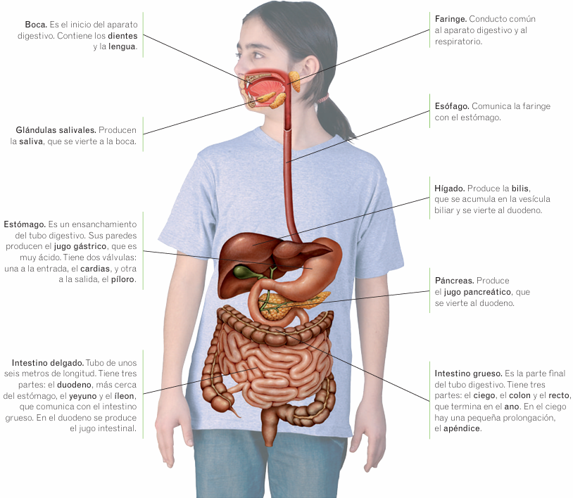

# Aparato digestivo

Recibe los alimentos y los transforma en sustancias más sencillas que pueden pasar a la sangre y ser utilizadas por las células. Estas sustancias son los nutrientes: agua, sales minerales, glúcidos, lípidos y proteínas. Forma parte de la función de nutrición.

## Anatomía

* **Tubo digestivo.** Conducto de unos 10 metros de longitud por el qu ese van desplazando y transformando los alimentos. Está formado por la boca, la faringe, el esófago, el estómago, el intestino delgado y el intestino grueso.
* **Glándulas digestivas.** órganos que segregan sustancias que ayudan a descomponer los alimentos. Son las glándulas salivales, el hígado y el páncreas.

> **Recuerda**  
> Las **glándulas** son órganos que producen ciertas sustancias y las vierten, bien a la sangre o bien a otro lugar. Por ejemplo, las glándulas sudoríparas producen el sudor y lo vierten a la superficie de la piel. Las glándulas salivales producen la saliva y la vierten a la boca.

## Función

La función del aparato digestivo es la de tomar los alimentos, transformarlos en sustancias más sencillas que puedan pasar a la sangre y eliminar los restos no digeridos.

Está dividida en cuatro procesos: 

* **Ingestión.** Es la entrada de los alimentos al tubo digestivo. Al introducir los alimentos por la boca, los dientes se encargan de triturarlos y la lengua ayuda a mezclar la saliva con los trozos de alimento. Esta mezcla de alimentos masticados y saliva se llama **bolo alimenticio** y pasa a la faringe y al esófago.
* **Digestión.** Es la descomposición de los alimentos en nutrientes:
    * En la boca: los dientes desmenuzan los alimentos y la saliva comienza a descomponerlos.
    *  En el estómago: los músculos de las paredes del estómago actúan como una batidora y mezclan el bolo alimenticio con el jugo gástrico, que continúa descomponiendo los alimentos. El resultado es una papilla espesa y muy ácida llamada **quimo**, que contiene algunos alimentos ya digeridos.
    * En el intestino delgado: el quimo llega al comienzo del intestino delgado, el duodeno. Allí se mezcla con la bilis, el jugo pancreático y el jugo intestinal. Estas sustancias terminan de digerir los alimentos. El resultado es una papilla líquida llamada **quilo** que contiene los nutrientes de los alimentos y las sustancias que no han sido digeridas.
* **Absorción.** Es el paso de los nutrientes desde el tubo digestivo a la sangre. Se produce en las paredes del intestino delgado, que están formadas por multitud de pequeñas prolongaciones, llamadas **vellosidades intestinales**. Estas vellosidades absorben los nutrientes y los pasan al interior de los vasos sanguíneos que contienen.
* **Egestión.** Es la expulsión de los restos no digeridos de los alimentos. Las sustancias que no han sido absorbidas pasan al intestino grueso, que absorbe el agua y las sales minerales, de manera que las sustancias de desecho se hacen más sólidas y se convierten en las **heces fecales**, que se expulsan por el ano. Los alimentos ricos en fibra facilitan la egestión.