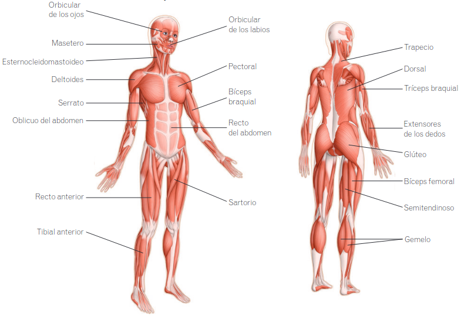

# Sistema muscular

* **Músculos.** Órganos que varían su tamaño en respuesta a señales del sistema nervioso. Cuando reciben una señal del cerebro, los músculos se contraen y disminuyen su longitud. Cuando dejan de recibir la señal, recuperan su longitud inicial.
  * Músculo esquelético. Forman parte del aparato locomotor y permiten los movimientos voluntarios.
  * Músculo liso. Tapizan el interior de las vísceras y permiten los movimientos involuntarios.
  * Músculo cardiaco. Es el músculo del corazó y es involuntario.
* **Tendones.** Cordones que unen los músculos a los huesos. Así, al contraerse los músculos, los tendones tiran de los huesos a los que están unidos y hacen que se muevan.

> **Así funciona**  
> Muchos músculos funcionan como una pareja de **antagonistas**, es decir, como una pareja de músculos con acciones opuestas. Por ejemplo, en la articulación del codo actúan el bíceps braquial y el tríceps braquial. Si uno se contrae, el otro se relaja, y viceversa.

