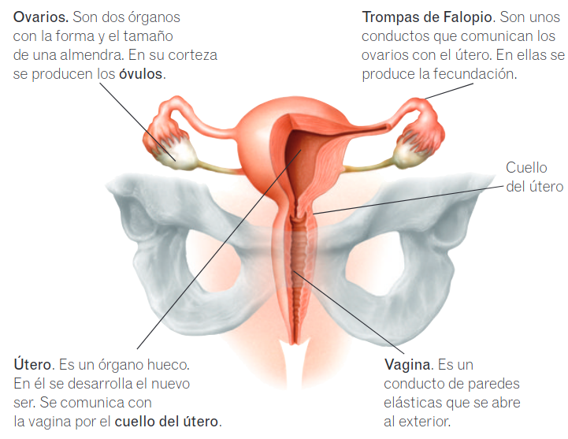
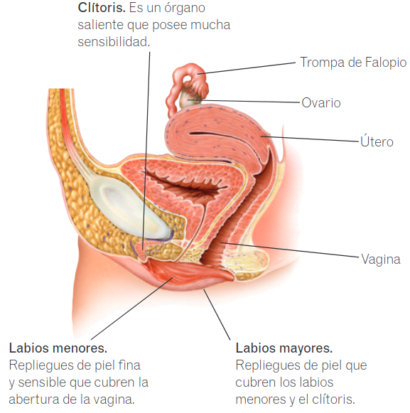

# Aparato reproductor

## Aparato reproductor femenino

### Anatomía

* **Ovarios.** Son dos órganos con la forma y el tamaño de una almendra. En su corteza se producen los **óvulos**.
* **Trompas de Falopio.** Son unos conductos que comunican los ovarios con el útero. En ellas se produce la fecundación.
* **Útero.** Es un órgano hueco. En él se desarrolla el nuevo ser. Se comunica con la vagina por el **cuello del útero**.
* **Vagina.** Es un conducto de paredes elásticas que se abre al exterior.
* **Clítoris.** Es un órgano saliente que posee mucha sensibilidad.
* **Labios menores.** Repliegues de piel fina y sensible que cubren la abertura de la vagina.
* **Labios mayores.** Repliegues de piel que cubren los labios menores y el clítoris.

### Ciclo menstrual

En la mujer cada mes se repite un ciclo cuyo objetivo es preparar su cuerpo para un posible embarazo. A lo largo de este ciclo el tejido del interior del útero, que se llama **endometrio**, va engrosando, para permitir el desarrollo del nuevo ser. Hacia la mitad del ciclo se produce la **ovulación**, que es la salida del óvulo del ovario. Si el óvulo no es fecundado antes de 24 horas, muere. En ese caso se expulsa el óvulo junto con el tejido del endometrio que se había formado. Esto causa una pequeña hemorragia, la **menstruación**. Este ciclo se repite cada 28 días, aproximadamente, desde la pubertad hasta la **menopausia** y está controlado por diversas hormonas.

> **Conoce el significado**
> Menopausia procede del griego _men_ (mes) y _pausis_ (pausa).

## Aparato reproductor masculino

