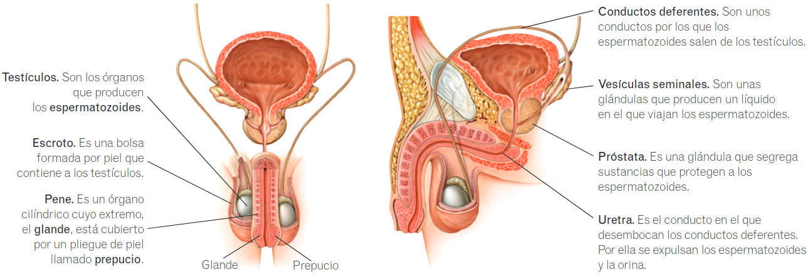

# Aparato reproductor

## Aparato reproductor femenino

### Anatomía

* **Ovarios.** Son dos órganos con la forma y el tamaño de una almendra. En su corteza se producen los **óvulos**.
* **Trompas de Falopio.** Son unos conductos que comunican los ovarios con el útero. En ellas se produce la fecundación.
* **Útero.** Es un órgano hueco. En él se desarrolla el nuevo ser. Se comunica con la vagina por el **cuello del útero**.
* **Vagina.** Es un conducto de paredes elásticas que se abre al exterior.
* **Clítoris.** Es un órgano saliente que posee mucha sensibilidad.
* **Labios menores.** Repliegues de piel fina y sensible que cubren la abertura de la vagina.
* **Labios mayores.** Repliegues de piel que cubren los labios menores y el clítoris.

### Ciclo menstrual

En la mujer cada mes se repite un ciclo cuyo objetivo es preparar su cuerpo para un posible embarazo. A lo largo de este ciclo el tejido del interior del útero, que se llama **endometrio**, va engrosando, para permitir el desarrollo del nuevo ser. Hacia la mitad del ciclo se produce la **ovulación**, que es la salida del óvulo del ovario. Si el óvulo no es fecundado antes de 24 horas, muere. En ese caso se expulsa el óvulo junto con el tejido del endometrio que se había formado. Esto causa una pequeña hemorragia, la **menstruación**. Este ciclo se repite cada 28 días, aproximadamente, desde la pubertad hasta la **menopausia** y está controlado por diversas hormonas.

> **Conoce el significado**
> Menopausia procede del griego _men_ (mes) y _pausis_ (pausa).

## Aparato reproductor masculino

### Anatomía

* **Testículos.** Son los órganos que producen los **[espermatozoides](../cell/cell.md#células-reproductoras-o-gametos)**.
* **Escroto.** Es una bolsa formada por piel que contiene a los testículos.
* **Pene.** Es un órgano cilíndrico cuyo extremo, el **glande**, está cubierto por un pliegue de piel llamado **prepucio**.
* **Conductos deferentes.** Son unos conductos por los que los espermatozoides salen de los testículos.
* **Vesículas seminales.** Son unas glándulas que producen un líquido en el que viajan los espermatozoides.
* **Próstata.** Es una glándula que segrega sustancias que protegen a los espermatozoides.
* **Uretra.** Es el conducto en el que desembocan los conductos deferentes. Por ella se expulsan los espermatozoides y la orina.

## Fecundación

Durante el acto sexual o coito, al producirse la eyaculación, el semen se deposita en la vagina y los espermatozoides viajan hasta la **trompa de Falopio**. Si en la trompa se encuentra un óvulo, los espermatozoides lo rodean y se pegan a él. Solo uno de ellos atraviesa las cubiertas que rodean al óvulo e introduce la cabeza en su interior. El material genético del óvulo y el del espermatozoide se fusionan. De este modo se forma el **cigoto** o célula huevo. Los espermatozoides sobreviven hasta cinco días en el interior del aparato reproductor femenino.

## Desarrollo del embarazo

Con la fecundación da comienzo el embarazo, que dura unas
cuarenta semanas y finaliza en el momento del parto. Durante el embarazo se interrumpe el ciclo menstrual, es decir, la mujer no tiene la menstruación ni se producen nuevos óvulos. El cigoto, que se forma en la trompa de Falopio, se divide varias veces hasta formar una masa de células que llega hasta el útero y se pega a su pared. Esta masa de células es el **embrión**. Junto al embrión se crean tres importantes estructuras que permiten su crecimiento y supervivencia:

* **Bolsa amniótica.** Es un saco lleno de líquido en el que crece el embrión.
* **Placenta.** Es un órgano que se forma en la pared del útero. Su función es unir el embrión a la madre, para que esta pueda nutrirle mientras está en su interior.
* **Cordón umbilical.** Es un tubo que está recorrido por varios vasos sanguíneos. Su función es transportar oxígeno y nutrientes de la placenta al embrión y sustancias de desecho del embrión a la placenta.

El embrión continúa aumentando el número de células y va creciendo y transformándose. A partir de la octava semana, cuando ya tiene el aspecto de un ser humano y se reconocen en él todos los
órganos, se le llama **feto**.

| **1. Fase de dilatación.** El cuello del útero aumenta su diámetro, los músculos del útero se contraen periódicamente y se abre la bolsa amniótica, lo que se llama «romper aguas». | **2. Fase de expulsión.** El feto sale por la vagina empujado por las contracciones del útero y por la fuerza que hace la madre. Primero suele aparecer la cabeza y luego el resto del cuerpo. | **3. Fase de alumbramiento.** Unos minutos después de salir el bebé, tras cortar el cordón umbilical y atarlo, se expulsan la placenta y restos del endometrio. |
|----------------------------|----------------------------|----------------------------|
|  |  |  |
