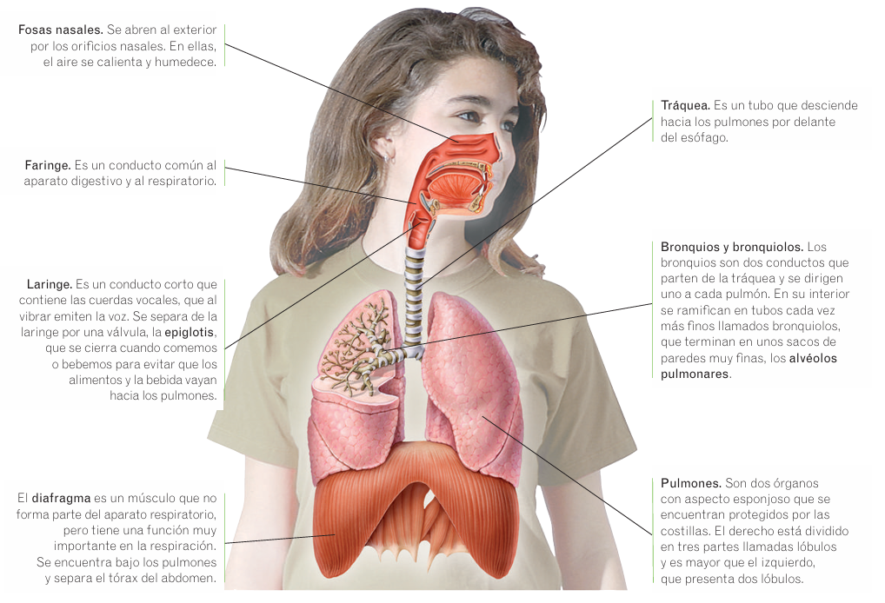

# Aparato respiratorio

La energía que necesitamos para funcionar se produce mediante un proceso químico que ocurre en las mitocondrias de todas las [células](../cell/cell.md) del cuerpo, llamado **respiración celular**. En la respiración celular los nutrientes se combinan con oxígeno y se produce energía y dióxido de carbono.

$$
Glucosa + O_2 \to Energía + CO_2 + H_2O
$$

El aparato respiratorio se encarga de tomar el oxígeno del aire, cederlo a la sangre y expulsar el dióxido de carbono.

## Anatomía

* **Pulmones.** Órganos donde se produce el **intercambio gaseoso**, es decir, el oxígeno pasa del aire a la sangre y el dióxido de carbono pasa de la sangre al aire.
* **Vías respiratorias.** Conductos por los que el aire entra y sale de los pulmones. Son las fosas nasales, la faringe, la laringe, la tráquea, los bronquios y los bronquiolos.

## Función

* **Ventilación pulmonar.** Es la entrada y salida edl aire de los pulmones. Se realiza gracias a los **músculos intercostales**, que unen unas costillas a otras, y al **diafragma**, que separa el tórax del abdomen. Se realiza en dos movimientos:
    * **Inspiración**, o entrada de aire en los pulmones.
    * **Espiración**, o salida del aire de los pulmones.
* **Intercambio gaseoso.** Cuando inspiramos, el aire recorre las vías respiratorias y llega a los **alvéolos pulmonares**, donde ocurre el intercambio gaseoso. Los alvéolos pulmonares son unos saquitos con paredes muy delgadas que están rodeados de unos vasos sanguíneos con paredes también muy finas, los **capilares**. En los alvéolos pulmonares, el oxígeno atraviesa las finas paredes de los alvéolos y los capilares y pasa a la sangre. Del mismo modo, el dióxido de carbono de la sangre pasa al interior de los alvéolos. Al espirar, el aire de los alvéolos, que es pobre en oxígeno y rico en dióxido de carbono, se expulsa al exterior.